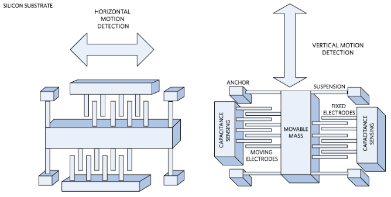

# Tutorial 14 — MEMS comb-drive accelerometer (how IMU sensing works)

**Demo:** `teaching-sims demo mems-accel`  
**Prerequisites:** none (good first IMU lab before [08 — Accelerometers](08-accelerometer.md))  
**Goal:** see how a spring–mass proof mass and capacitive comb fingers turn acceleration into a signal, and how **bias** vs **impulse** change that signal differently

---

## 1. Principles

### 1.1 Spring–mass–damper

A MEMS accelerometer suspends a **movable mass** on thin **suspension** beams. External acceleration \(a_{\mathrm{ext}}\) of the chip frame leaves the mass behind (relatively), so the displacement \(x\) obeys

\[
m\ddot{x}+c\dot{x}+kx=-m\,a_{\mathrm{ext}}.
\]

In steady state, \(x\approx -a_{\mathrm{ext}}/\omega_0^2\) with \(\omega_0=\sqrt{k/m}\).

### 1.2 Comb capacitance

Interdigitated **fixed** and **moving** electrodes form two capacitors. With nominal gap \(g_0\),

\[
C_1\propto\frac{1}{g_0-x},\qquad C_2\propto\frac{1}{g_0+x}.
\]

Differential \(\Delta C=C_1-C_2\) grows with \(x\). Electronics convert \(\Delta C\) (or a force-feedback null) into the reported acceleration \(a_{\mathrm{meas}}\).

### 1.3 Bias vs impulse

| Stimulus | What you see |
| --- | --- |
| **Output bias** | Mass centered, gaps equal, but \(a_{\mathrm{meas}}\) sits off zero |
| **Mechanical offset** | Mass off-center at rest; \(\Delta C\neq0\) looks like a constant accel bias |
| **Impulse** (underdamped) | Sharp kick on \(a_{\mathrm{ext}}\); \(x\) and \(a_{\mathrm{meas}}\) **ring** then decay |
| **Impulse** (overdamped) | Same kick; mass returns **without** oscillation |

A constant accel bias integrated in an INS becomes a velocity ramp and a quadratic position error (see [13 — INS](13-ins.md)). Here we stay at the sensor: how the MEMS structure itself responds.

---

## 2. UI map

| Element | Role |
| --- | --- |
| Comb schematic | Animated fingers / mass; scrub or Play to step through time |
| Speed (x realtime) | Slow-mo playback (default ~0.03x); drag lower to inspect impulse ring-down |
| \(a_{\mathrm{ext}}\) vs \(a_{\mathrm{meas}}\) | True frame accel vs reported signal |
| Proof-mass \(x\) | Displacement in micrometers |
| \(C_1\), \(C_2\), \(\Delta C\) | Comb capacitances (fF, teaching scale) |
| Output bias / Mech. offset | Two ways to get a nonzero reading at rest |
| Damping zeta | Underdamped (\(<1\)) rings; overdamped (\(\gtrsim1\)) does not |
| Lecture scenarios | Scripted bias / impulse checkpoints |

---

## 3. Experiments

### Experiment A — Ideal rest (~3 min)

1. Load **At rest (ideal)**.
2. Confirm \(a_{\mathrm{ext}}=0\), \(x\approx0\), \(C_1\approx C_2\), \(a_{\mathrm{meas}}\approx0\).
3. Scrub the view time — the schematic should stay centered.

### Experiment B — Output bias (~4 min)

1. Load **Output bias at rest**.
2. Schematic still looks balanced; plot of \(a_{\mathrm{meas}}\) is offset.
3. Teaching point: electronics can lie even when mechanics are perfect.

### Experiment C — Mechanical offset (~4 min)

1. Load **Mechanical offset looks like bias**.
2. Fingers are visibly off-center; \(\Delta C\neq0\) and \(a_{\mathrm{meas}}\neq0\) with \(a_{\mathrm{ext}}=0\).
3. Compare to Experiment B: same *symptom* (bias-like output), different *cause*.

### Experiment D — Impulse ring-down (~5 min)

1. Load **Impulse then ring-down** and press **Play**.
2. Watch the mass kick, then oscillate as the suspension rings.
3. Match the decaying oscillation on \(x\) / \(a_{\mathrm{meas}}\) to the short pulse on \(a_{\mathrm{ext}}\).

### Experiment E — Overdamped impulse (~4 min)

1. Load **Overdamped impulse**.
2. Same impulse energy; only \(\zeta\) changed — no ringing.
3. Ask: which damping would you prefer in a consumer IMU vs a vibration sensor?

### Experiment F — Constant accel (~3 min)

1. Load **Constant acceleration**.
2. Mass settles to a new position; \(a_{\mathrm{meas}}\) tracks \(a_{\mathrm{ext}}\) after the transient.

---

## 4. Checkpoint questions

1. Why can \(a_{\mathrm{meas}}\) be nonzero when the comb looks perfectly centered?
2. Why does an underdamped impulse produce a decaying sine on the output?
3. How would a constant output bias behave after double integration in an INS?
4. What does increasing \(\zeta\) do to the impulse response?

---

## 5. Next

Continue with [08 — Accelerometers](08-accelerometer.md) (specific force and tilt), then gyros and fusion.
